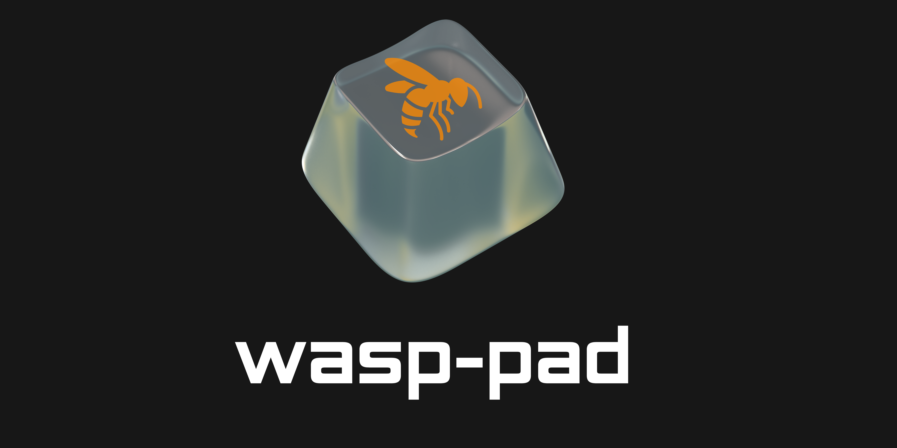
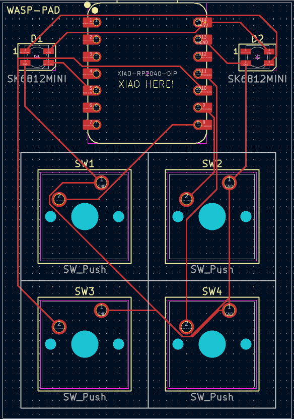

# wasp-pad
Open Source Linux Macropad and my learning journey creating it

---

I call my linux computer WaspBox, so I decided to make a complimentary macropad for my dev-workflow, however this is a learning process which I will document as I have never attempted to make a PCB board before. I will most likely make the buttons different keybinds to integrate in my [AwesomeWM](https://github.com/awesomeWM/awesome) workflow and my [text editor](https://github.com/neovim/neovim) setup.

---

### Schematics Diagram
   

---
### PCB Design
   

